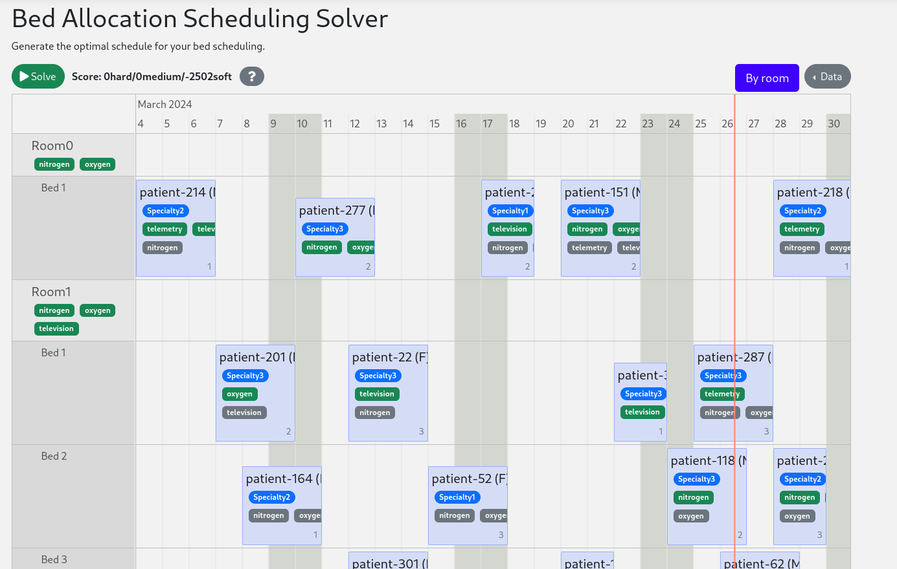

= 병상 배정 스케줄링 (Java, Quarkus, Maven)

병원 환자의 입원 기간에 병상을 배정하여 더 나은 일정을 생성합니다.

* <<run,애플리케이션 실행>>
* <<enterprise,Timefold Solver Enterprise Edition으로 실행>>
* <<package,패키징한 애플리케이션 실행>>
* <<container,컨테이너에서 애플리케이션 실행>>
* <<native,네이티브 실행>>

== 사전 요구 사항

. https://sdkman.io[Sdkman]을 사용하여 Java와 Maven을 설치합니다.
+
----
$ sdk install java
$ sdk install maven
----

[[run]]
== 애플리케이션 실행

. `timefold-quickstarts` 저장소를 clone하고 이 디렉터리로 이동합니다.
+
[source,shell]
----
$ git clone https://github.com/TimefoldAI/timefold-quickstarts.git
...
$ cd timefold-quickstarts/java/bed-allocation
----

. Maven으로 애플리케이션을 시작합니다.
+
[source,shell]
----
$ mvn quarkus:dev
----

. 브라우저에서 http://localhost:8080 을 엽니다.

. *Solve* 버튼을 클릭합니다.

그다음 _live coding_을 시도해 보세요.

. 소스 코드 일부를 변경합니다.
. 브라우저를 새로 고칩니다(F5).

변경 사항이 즉시 적용되는 것을 확인할 수 있습니다.

[[enterprise]]
== Timefold Solver Enterprise Edition으로 애플리케이션 실행

대규모 확장이 필요한 경우 상용 제품인
https://docs.timefold.ai/timefold-solver/latest/enterprise-edition/enterprise-edition[Timefold Solver Enterprise Edition]으로 전환합니다.
비공개 Enterprise Maven 저장소에 접근하는 데 필요한 자격 증명은
https://timefold.ai/contact[Timefold에 문의]하여 발급받습니다.

. 홈 디렉터리에 `.m2/settings.xml`을 만들고 다음 내용을 작성합니다.
+
--
[source,xml,options="nowrap"]
----
<settings>
  ...
  <servers>
    <server>
      <!-- "my_username"과 "my_password"를 Timefold 담당자로부터 받은 자격 증명으로 바꿉니다. -->
      <id>timefold-solver-enterprise</id>
      <username>my_username</username>
      <password>my_password</password>
    </server>
  </servers>
  ...
</settings>
----

자세한 내용은 https://maven.apache.org/settings.html[Maven 설정 참고 문서]를
확인합니다.
--

. Maven으로 애플리케이션을 시작합니다.
+
[source,shell]
----
$ mvn clean quarkus:dev -Denterprise
----

. 브라우저에서 http://localhost:8080 을 엽니다.

. *Solve* 버튼을 클릭합니다.

그다음 _live coding_을 시도해 보세요.

. 소스 코드 일부를 변경합니다.
. 브라우저를 새로 고칩니다(F5).

변경 사항이 즉시 적용되는 것을 확인할 수 있습니다.

[[package]]
== 패키징한 애플리케이션 실행

`quarkus:dev` 모드에서 반복 작업을 마쳤다면 일반 JAR 파일로 실행할 수 있도록
애플리케이션을 패키징합니다.

. Maven으로 빌드합니다.
+
[source,shell]
----
$ mvn package
----
. Maven 출력물을 실행합니다.
+
[source,shell]
----
$ java -jar ./target/quarkus-app/quarkus-run.jar
----
+
[NOTE]
====
8081 포트로 실행하려면 `-Dquarkus.http.port=8081`을 추가합니다.
====

. 브라우저에서 http://localhost:8080 을 엽니다.

. *Solve* 버튼을 클릭합니다.

[[container]]
== 컨테이너에서 애플리케이션 실행

. 컨테이너 이미지를 빌드합니다.
+
[source,shell]
----
$ mvn package -Dcontainer
----

컨테이너 이미지 이름은 다음과 같습니다.

. 컨테이너를 실행합니다.
+
[source,shell]
----
$ docker run -p 8080:8080 --rm $USER/bed-allocation:1.0-SNAPSHOT
----

[[native]]
== 네이티브로 실행

서버리스 배포의 시작 성능을 높이려면 애플리케이션을 네이티브 실행 파일로
빌드합니다.

. https://quarkus.io/guides/building-native-image#configuring-graalvm[GraalVM을 설치하고 `gu install`로 native-image 도구를 설치]합니다.

. 네이티브로 컴파일합니다. 몇 분 정도 걸릴 수 있습니다.
+
[source,shell]
----
$ mvn package -Dnative
----

. 네이티브 실행 파일을 실행합니다.
+
[source,shell]
----
$ ./target/*-runner
----

. 브라우저에서 http://localhost:8080 을 엽니다.

. *Solve* 버튼을 클릭합니다.

== 추가 정보

https://timefold.ai[timefold.ai]를 확인합니다.
