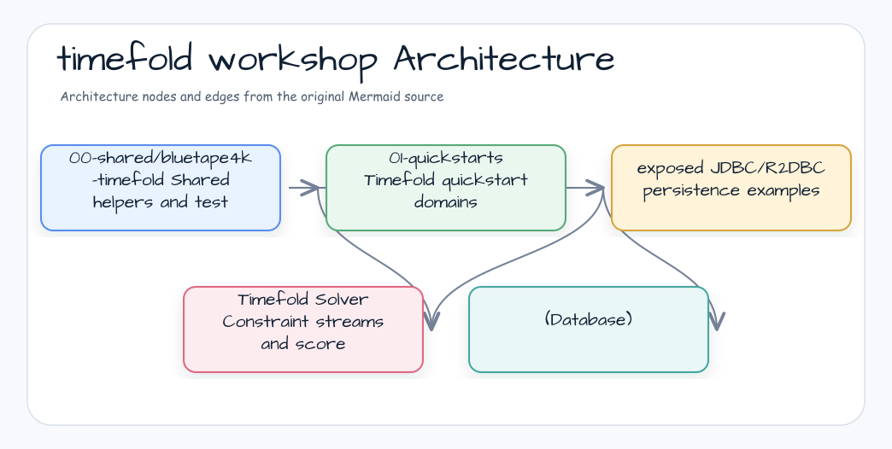

# timefold-workshop

[English](README.md) | [한국어](README.ko.md)


[Timefold Solver](https://timefold.ai/)의 제약 모델링, 스케줄 최적화,
점수 계산, 영속성 연동을 Kotlin/Spring 예제로 학습하는 워크숍 저장소입니다.

## 프로젝트 목적

`timefold-workshop`은 스케줄링 시스템에서 자주 등장하는 최적화 문제를 실행
가능한 예제로 다룹니다. 시간대 배정, 이벤트 충돌 회피, 리소스 제약 준수,
소프트 선호도 균형 조정 같은 문제를 Timefold Solver로 모델링합니다.

## 제공 기능

- **Quickstart 예제** - Timefold planning 핵심 개념을 빠르게 확인합니다.
- **스케줄링 도메인 모델** - 예약, 시간대, 리소스, 제약 조건을 모델링합니다.
- **공통 bluetape4k 헬퍼** - Kotlin 친화적인 Timefold 테스트와 예제를 지원합니다.
- **Exposed 영속성 예제** - JDBC/R2DBC 기반 solver application 구성을 보여줍니다.
- **제약 중심 테스트** - 스케줄링 동작을 테스트로 검증합니다.

## 아키텍처



## 모듈

| 모듈 | 역할 |
|---|---|
| `bluetape4k-timefold` | 공통 Timefold helper API와 테스트 유틸리티. |
| `school-timetabling` | 수업을 교실과 시간대에 배정하는 quickstart. |
| `bed-allocation` | 제한된 병상을 제약 조건에 맞게 배정하는 quickstart. |
| `jdbc-examples` | Solver-backed service를 위한 Exposed JDBC 영속성 예제. |
| `r2dbc-examples` | Reactive solver-backed service를 위한 Exposed R2DBC 영속성 예제. |

## 환경

- Java 21+
- Kotlin 2.3+
- Spring Boot 3.4+
- Timefold Solver
- Kotlin Exposed 영속성 예제

## 빌드

```bash
./gradlew build
./gradlew test
./gradlew :school-timetabling:test
./gradlew :bed-allocation:test
```

## 참고 자료

- [timefold.ai](https://timefold.ai/) - Timefold 공식 웹사이트
- [timefold-solver](https://github.com/TimefoldAI/timefold-solver) - Timefold Solver
- [timefold-quickstarts](https://github.com/TimefoldAI/timefold-quickstarts) - Timefold Quickstarts
