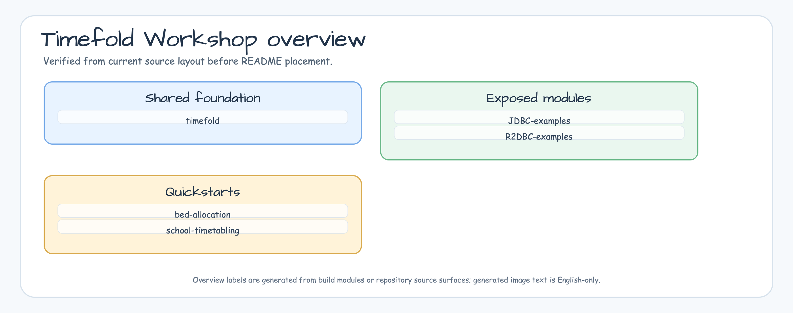
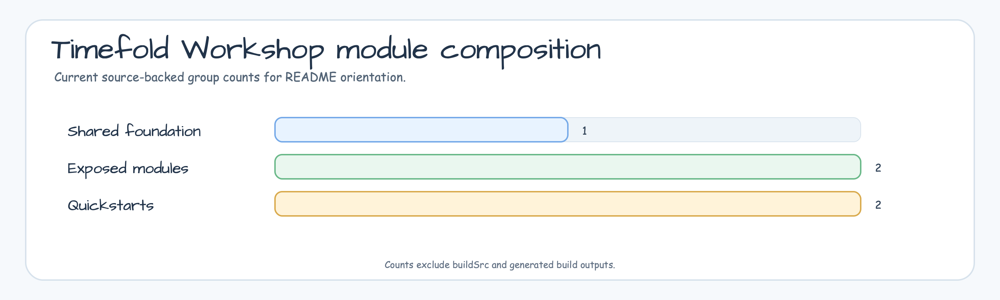

# timefold-workshop

[English](README.md) | [한국어](README.ko.md)


Kotlin/Spring workshop examples for learning [Timefold Solver](https://timefold.ai/)
constraint modeling, scheduling optimization, score calculation, and persistence
integration.

## Project Purpose

`timefold-workshop` is a runnable learning workspace for optimization problems
that appear in scheduling systems: assigning timeslots, placing events without
conflicts, respecting resource constraints, and balancing soft preferences.

## What It Provides

- **Quickstart examples** for core Timefold planning concepts.
- **Scheduling problem models** for appointments, timeslots, resources, and
  constraints.
- **Shared bluetape4k helpers** for Kotlin-friendly Timefold tests and examples.
- **Exposed persistence examples** for JDBC/R2DBC-backed solver applications.
- **Constraint-focused tests** that prove scheduling behavior.

<!-- README_VISUAL_OVERVIEW:START -->
## Overview Diagram



## Module Composition Chart


<!-- README_VISUAL_OVERVIEW:END -->

## Architecture


## Modules

| Module | Role |
|---|---|
| `bluetape4k-timefold` | Shared Timefold helper APIs and test utilities. |
| `school-timetabling` | Quickstart for assigning lessons to rooms and timeslots. |
| `bed-allocation` | Quickstart for allocating limited beds under planning constraints. |
| `exposed-jdbc-examples` | Exposed JDBC persistence examples for solver-backed services. |
| `exposed-r2dbc-examples` | Exposed R2DBC persistence examples for reactive solver-backed services. |

## Requirements

- Java 25+
- Kotlin 2.3+
- Spring Boot 3.5+
- Timefold Solver
- Kotlin Exposed for persistence examples

## Build

```bash
./gradlew build
./gradlew test
./gradlew :school-timetabling:test
./gradlew :bed-allocation:test
```

## Timefold Solver 2.6.0 verification

The central `bluetape4k-dependencies` BOM owns the Timefold version. The
`libs.timefold.solver.*` aliases in `gradle/libs.versions.toml` stay versionless,
so every module resolves `timefold-solver-core`, Jackson integration, and the
Spring Boot starter to `2.6.0` without a local version override.

Run the issue-specific regression checks from the repository root:

```bash
./gradlew :bluetape4k-timefold:test --tests '*ListShadowDomainTest'
./gradlew :school-timetabling:test --tests '*TimetableIncrementalScoreTest'
./gradlew :school-timetabling:test --tests '*TimetableJobRegistryTest'
./gradlew :bed-allocation:test --tests '*BedAllocationIncrementalScoreTest'
./gradlew :exposed-jdbc-examples:test
./gradlew :exposed-r2dbc-examples:test
```

The shared fixture exercises `@PlanningListVariable`,
`@IndexShadowVariable`, and declarative `@ShadowVariable` updates. School and
bed fixtures cover join/filter score transitions, while `TimetableJobRegistry`
keeps SolverManager best/final/failure callbacks in one terminal state. The
community build keeps the Enterprise `ScoreAnalysis` endpoint test disabled;
it is reported as N/A and does not require Enterprise credentials. Timefold
2.6 Neighborhoods and custom-move APIs are not used because this workshop has
no active source surface for them.

The persistence examples are separate Gradle projects. JDBC and R2DBC tests
should be run one at a time when Testcontainers is enabled. If a Gradle daemon
terminates during R2DBC compilation, retry with
`--no-daemon --max-workers=1`; this changes process isolation only and does not
change the repository configuration.

## References

- [timefold.ai](https://timefold.ai/) - Timefold official website
- [timefold-solver](https://github.com/TimefoldAI/timefold-solver) - Timefold Solver
- [timefold-quickstarts](https://github.com/TimefoldAI/timefold-quickstarts) - Timefold Quickstarts
