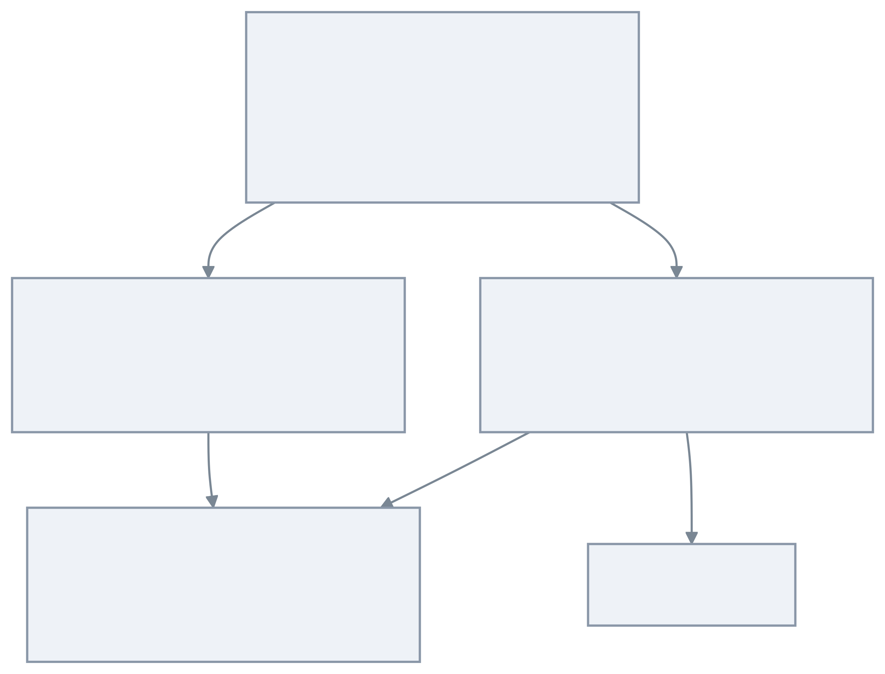

# timefold-workshop

[English](README.md) | [한국어](README.ko.md)


Kotlin/Spring workshop examples for learning [Timefold Solver](https://timefold.ai/)
constraint modeling, scheduling optimization, score calculation, and persistence
integration.

## Project Purpose

`timefold-workshop` is a runnable learning workspace for optimization problems
that appear in scheduling systems: assigning timeslots, placing events without
conflicts, respecting resource constraints, and balancing soft preferences.

## What It Provides

- **Quickstart examples** for core Timefold planning concepts.
- **Scheduling problem models** for appointments, timeslots, resources, and
  constraints.
- **Shared bluetape4k helpers** for Kotlin-friendly Timefold tests and examples.
- **Exposed persistence examples** for JDBC/R2DBC-backed solver applications.
- **Constraint-focused tests** that prove scheduling behavior.

## Architecture



## Modules

| Module | Role |
|---|---|
| `bluetape4k-timefold` | Shared Timefold helper APIs and test utilities. |
| `school-timetabling` | Quickstart for assigning lessons to rooms and timeslots. |
| `bed-allocation` | Quickstart for allocating limited beds under planning constraints. |
| `jdbc-examples` | Exposed JDBC persistence examples for solver-backed services. |
| `r2dbc-examples` | Exposed R2DBC persistence examples for reactive solver-backed services. |

## Requirements

- Java 21+
- Kotlin 2.3+
- Spring Boot 3.4+
- Timefold Solver
- Kotlin Exposed for persistence examples

## Build

```bash
./gradlew build
./gradlew test
./gradlew :school-timetabling:test
./gradlew :bed-allocation:test
```

## References

- [timefold.ai](https://timefold.ai/) - Timefold official website
- [timefold-solver](https://github.com/TimefoldAI/timefold-solver) - Timefold Solver
- [timefold-quickstarts](https://github.com/TimefoldAI/timefold-quickstarts) - Timefold Quickstarts
